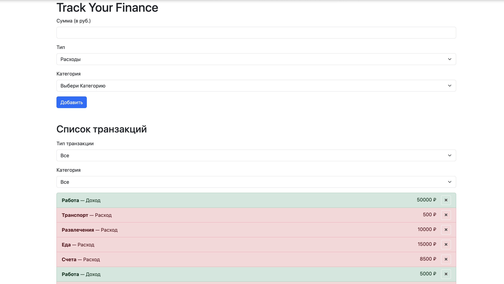
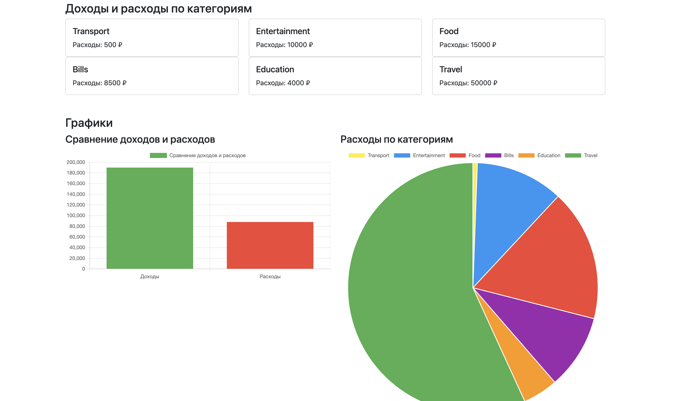

## Finance Tracker (финансовый трекер)

Проект представляет собой приложение для отслеживания личных финансов. 
Пользователи могут добавлять доходы и расходы, фильтровать транзакции по категориям,
просматривать сводку по общим доходам и расходам, а также анализировать свои финансы
с помощью графиков.

Приложение предоставляет простой интерфейс для добавления транзакций, отображения 
их по категориям и сравнения доходов и расходов с помощью визуальных графиков.

### Функциональность

1. **Добавление транзакций:**
    - Пользователи могут добавлять транзакции (доходы или расходы).
    - Для каждой транзакции можно указать сумму, тип (доход или расход), а также категорию.

2. **Просмотр списка транзакций:**
    - Все добавленные транзакции отображаются в виде списка.
    - Можно удалить транзакцию, нажав на иконку "×" рядом с ней.

3. **Фильтрация транзакций:**
    - Пользователи могут фильтровать транзакции по типу (доходы или расходы) и категории.

4. **Финансовая сводка:**
    - На главной странице отображаются общие доходы, расходы и баланс.
    - Также отображается сводка по доходам и расходам по категориям.

5. **Графики:**
    - **Столбчатая диаграмма** для сравнения общих доходов и расходов.
    - **Круговая диаграмма** для отображения распределения расходов по категориям.

### Технологии

- React
- Redux Toolkit
- Chart.js
- Bootstrap
- JavaScript 

Главная страница:

Сводка:

