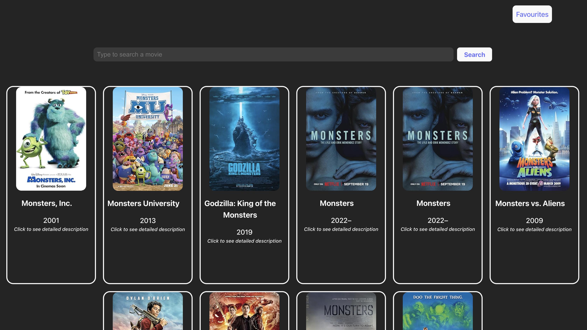
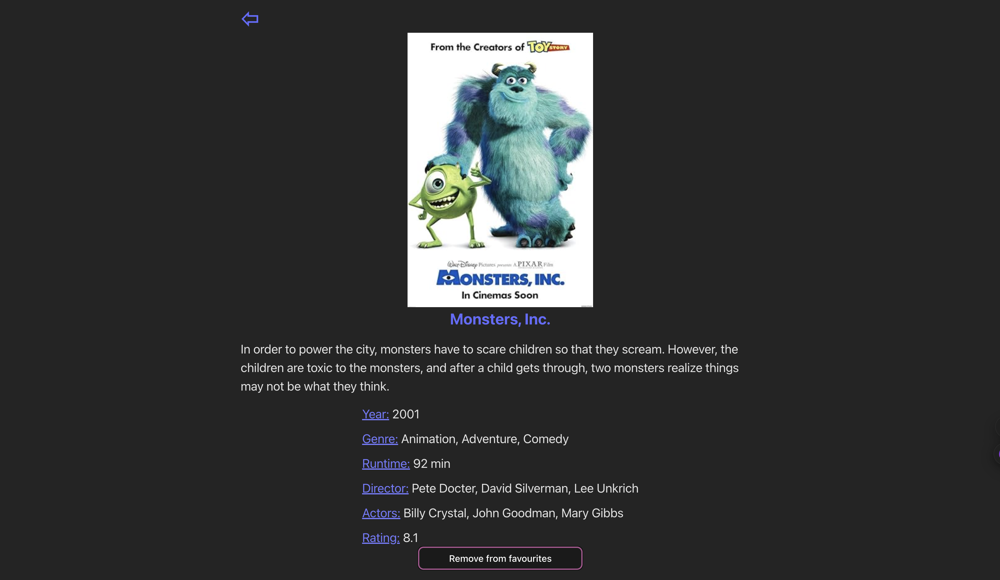
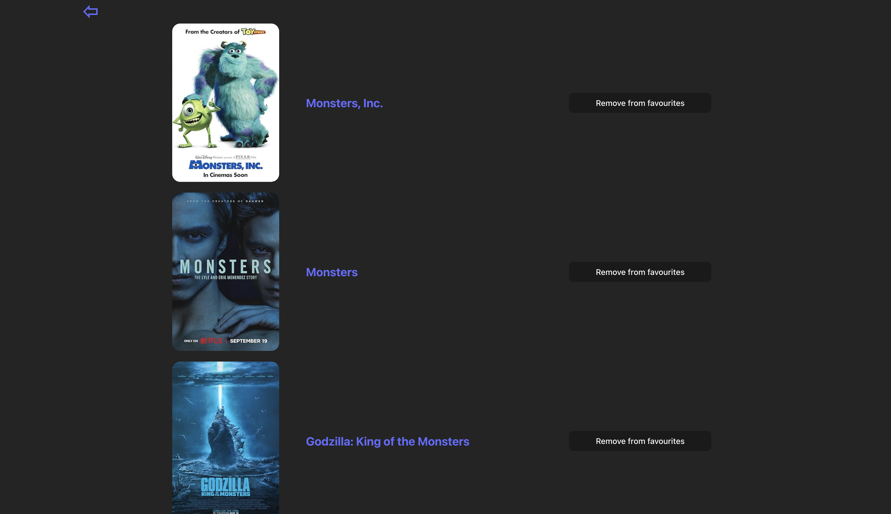

### Поиск фильмов (movie search):

Приложение на React, позволяющее искать фильмы по названию,
просматривать подробную информацию о каждом фильме и добавлять
понравившиеся в список избранного. Используется Redux Toolkit
для глобального состояния и OMDb API для получения данных о фильмах.

#### <strong>Функциональность: </strong>  
- Поиск фильмов по названию (только на английском)  
- Просмотр подробной информации о фильме  
- Добавление фильмов в избранное  
- Удаление фильмов из избранного  
- Сохранение избранных фильмов в локальном хранилище  

#### <strong>Технологии: </strong>  
- React  
- Redux Toolkit  
- React Router
- OmDb API  

Главная страница:

Карточка фильма:

Избранное:

