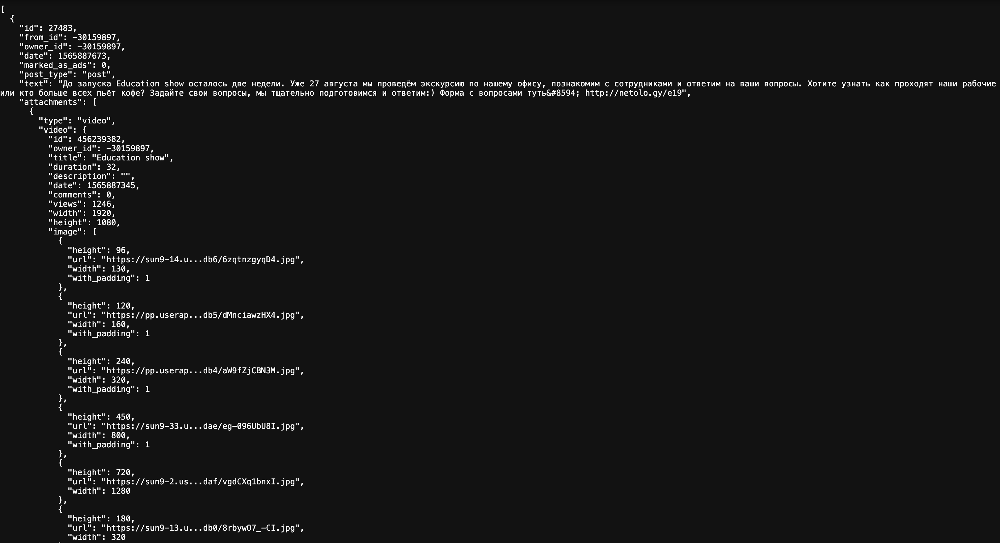

### Загрузка новостей (news loader):

Приложение на React для загрузки новостей с постраничной
подгрузкой. Использует Redux Toolkit и Redux-Saga для
управления состоянием и сайд-эффектами.

#### <strong>Функциональность: </strong>  
- Загрузка новостей с сервера по API  
- Отображение текста, изображений и ссылок из вложений  
- Поддержка постраничной загрузки (по 5 элементов)  
- Исключение повторяющихся новостей  
- Индикация загрузки и ошибок  
- Возможность подгрузки новостей по кнопке  

#### <strong>Технологии: </strong>  
- React  
- Redux Toolkit  
- Redux-Saga
- Axios  

Данные с сервера:

Первоначальная загрузка новостей:

Полученные и загруженные новости:

