# Sole Style — Интернет-магазин обуви

**Solo Style** — это многостраничное приложение (SPA) интернет-магазина обуви, разработанное на **React** с использованием 
**Redux Toolkit** и **React Router**. Проект включает просмотр моделей кроссовок, выбор размера, добавление в корзину, подсчёт суммы и 
управление товарами.

### Технологии

-  **React** 
-  **Redux Toolkit** 
-  **React Router** 
-  **SCSS** 
- Корзина с поддержкой количества и выбора размера

#### Главная страница:

Функции:
- Отображает шапку (Header) и футер (Footer).
- Показывает баннер (Banner) с визуальным акцентом.
- Загружает и отображает коллекцию обуви через компонент Collection.
- Каждый товар кликабелен — при клике происходит сохранение модели в Redux и переход на страницу конкретной модели.

Desktop:
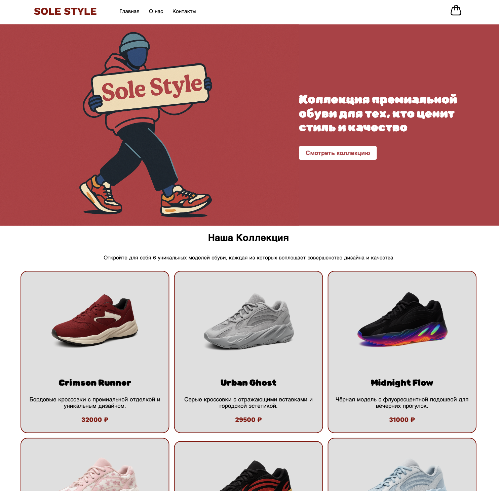
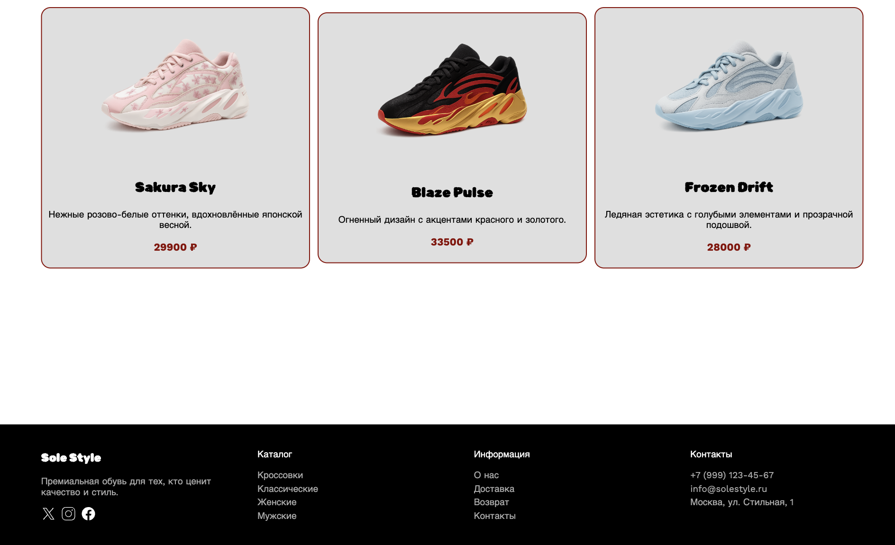

Mobile:  
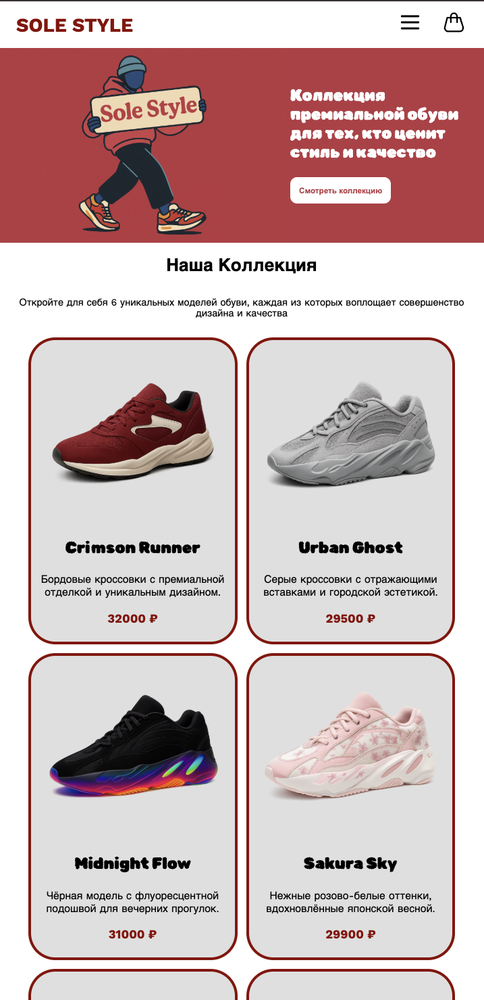
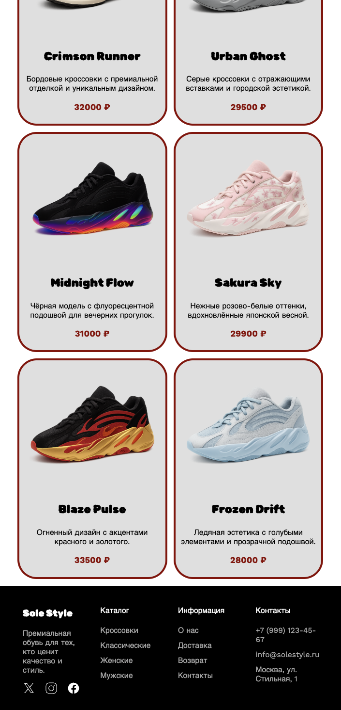

#### Страница "о нас":
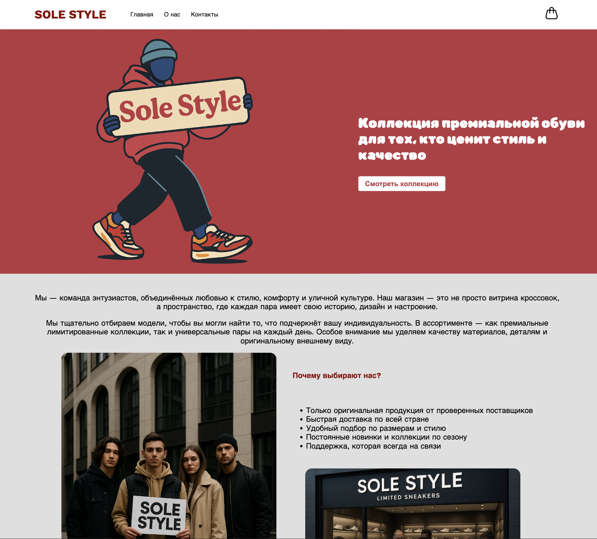
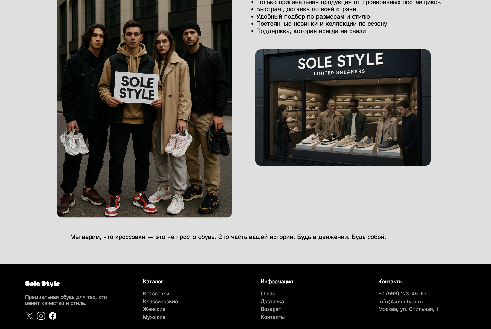

#### Страница "Контакты":
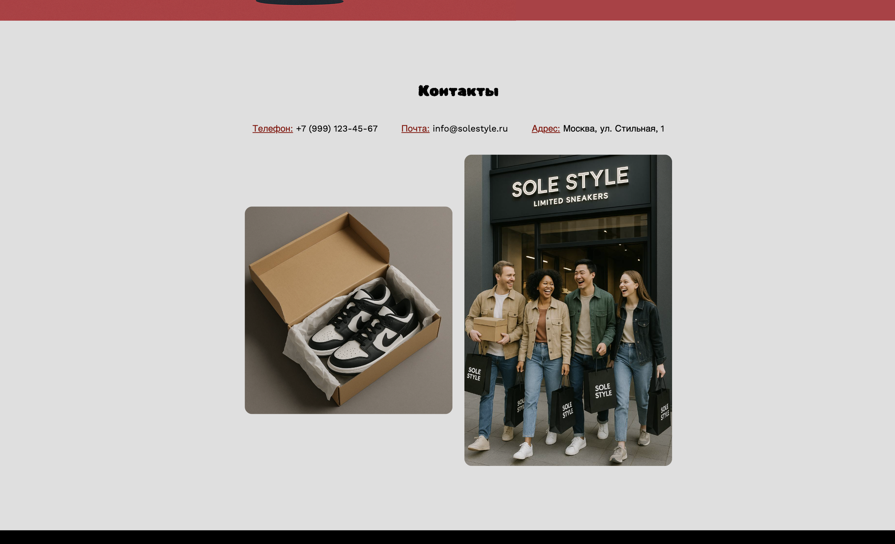

#### Карточка товара:

Desktop:
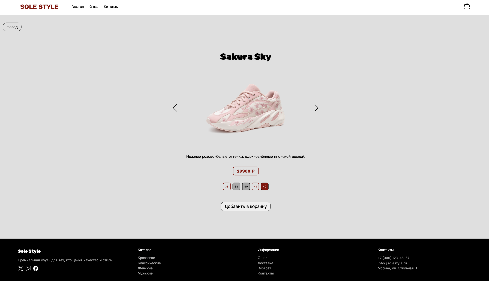

Mobile:  
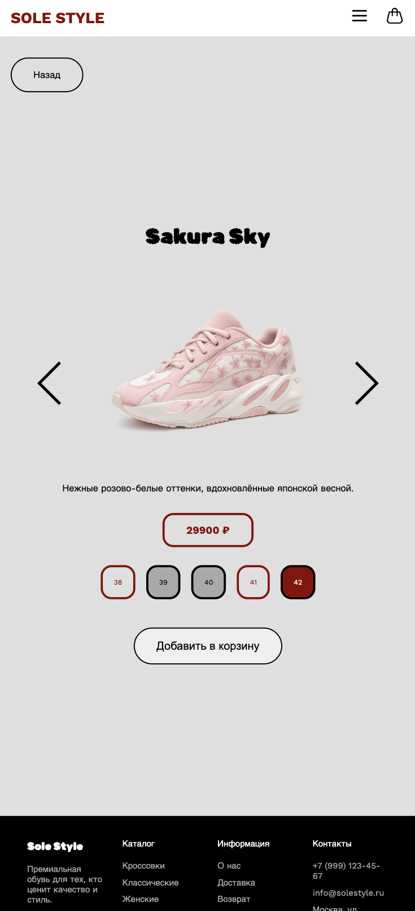

#### Корзина:
Функционал:
- Отображение товаров (Показывает список всех добавленных товаров)
- Показывет выбранный размер, кол-во, цены за единицу товара или за несколько товаров
- Отображает итоговую сумму всей корзины

Управление количеством:
- При добавлении в корзину одинакового товара с тем же размером количество увеличивается автоматически.

Удаление товара:
- Можно удалить товар из корзины поштучно — при удалении количество уменьшается на 1, если это последняя единица, позиция полностью удаляется.

Подсчёт общей суммы:
- Вычисляется и отображается общая стоимость всех товаров в корзине.

Навигация:
- Есть кнопка возврата на предыдущую страницу.

Desktop:
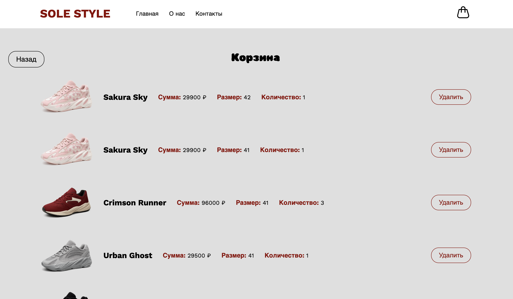

Mobile:  
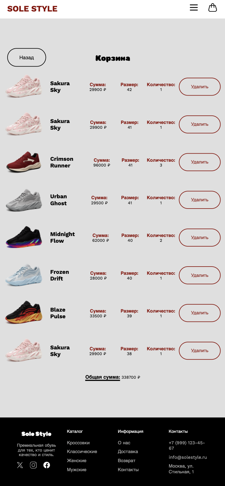